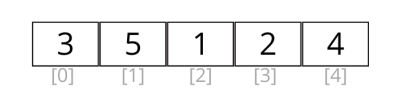
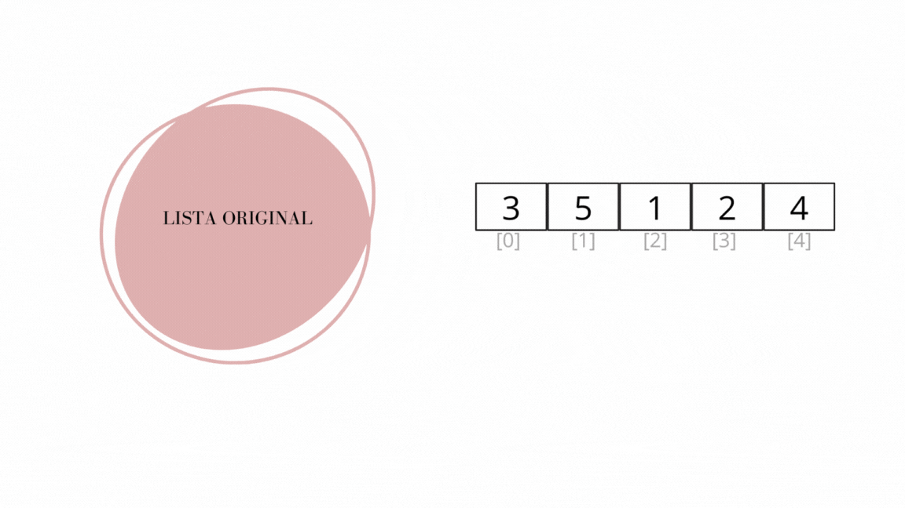

# Algoritmo de Ordenação: Bubble Sort

Algoritmo é uma descrição, passo a passo, para a realização de uma determinada tarefa.
 
 
Um dos problemas que podem ser resolvidos por meio de um algoritmo é a ordenação de elementos, como números ou palavras.
 
 
Essa tarefa pode ser realizada de diferentes formas, ou seja, existem diversos algoritmos diferentes que produzirão o mesmo resultado.
 
 
No entanto, em muitas situações, o processo importa tanto quanto o resultado, e um determinado algoritmo pode ser mais adequado que outro, ainda que seus produtos sejam idênticos.
 
 
Quando se trata da ordenação de elementos, um dos algoritmos existentes é o Bubble Sort, ou "Classificação por Bolha".

# Bubble Sort

O Bubble Sort é um algoritmo simples, mas pouco eficiente.
 Com ele, cada elemento de uma lista é comparado com o elemento seguinte, e caso o segundo seja menor do que o primeiro, eles trocam de lugar.
  A lista precisa ser percorrida quantas vezes seja necessário, até que todos os elementos estejam ordenados.

Vamos exemplificar com a seguinte lista numérica, onde os valores entre [ ] representam a posição de cada elemento:

* **Primeira passagem:**
    - O elemento na posição [0] é comparado ao elemento na posição [1], e caso o elemento [1] seja menor, eles trocam de lugar:
          5 < 3: Falso - Os elementos são mantidos em suas posições.  
    - O elemento na posição [1] é comparado ao elemento na posição [2], e caso o elemento [2] seja menor, eles trocam de lugar:
          1 < 5: Verdadeiro - Os elementos trocam de lugar.  
    - O elemento na posição [2] é comparado ao elemento na posição [3], e caso o elemento [3] seja menor, eles trocam de lugar:
        2 < 5: Verdadeiro - Os elementos trocam de lugar.  
    - O elemento na posição [3] é comparado ao elemento na posição [4], e caso o elemento [4] seja menor, eles trocam de lugar:
        4 < 5: Verdadeiro - Os elementos trocam de lugar.

O processo se repete até que todos os elementos estejam ordenados.
