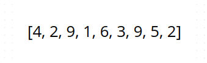
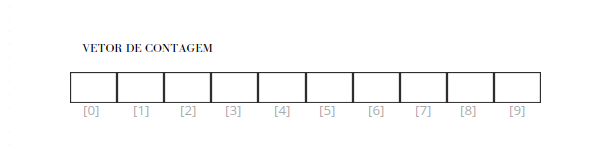
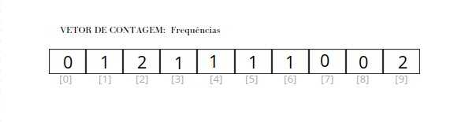
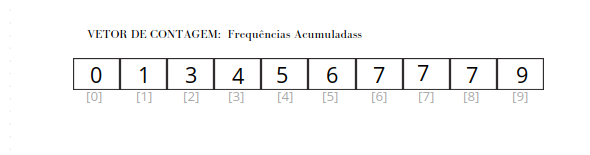
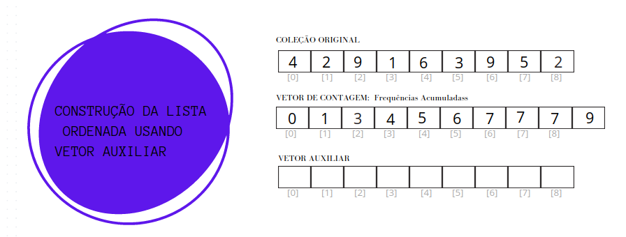
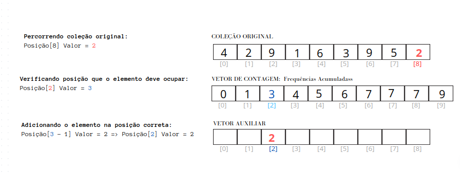
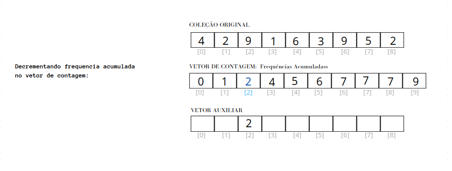

# Algoritmo de Ordenação: Counting Sort

Algoritmo é uma descrição, passo a passo, para a realização de uma determinada tarefa.
 
 
Um dos problemas que podem ser resolvidos por meio de um algoritmo é a ordenação de elementos, como números ou palavras.
 
 
Essa tarefa pode ser realizada de diferentes formas, ou seja, existem diversos algoritmos diferentes que produzirão o mesmo resultado.
 
 
No entanto, em muitas situações, o processo importa tanto quanto o resultado, e um determinado algoritmo pode ser mais adequado que outro, ainda que seus produtos sejam idênticos.
 
 
Quando se trata da ordenação de elementos, um dos algoritmos existentes é o Counting Sort, ou "Ordenação por Contagem".

# Counting Sort

Counting Sort é um algoritmo de ordenação adequado, em especial, para coleções de numeros inteiros positivos, nos casos em que o intervalo de valores que os seus elementos podem assumir já seja conhecido.

Este algoritmo utiliza a frequência de cada valor para realizar a ordenação de forma linear, e é consideravelmente mais eficinente para um intervalo pequeno de valores.

Para demonstrar o funcionamento do Counting Sort, vamos considerar a seguinte coleção de valores inteiros positivos:

## Passos do Counting Sort

1. **Contagem das Frequências:**
    - Primeiramente, criamos um vetor de contagem, com tamanho igual ao intervalo dos valores na lista. Como 0 (zero) também é um valor válido, o tamanho da lista será igual ao maior valor existente adicionado de um. 
      -  _Tamanho do vetor de contagem: 9 + 1 = 10_
      

      
      

    - Percorremos a lista, contando quantas vezes cada valor aparece e atualizando o vetor de contagem com essas frequências.
    - No vetor acima temos as sequintes frequências:
      - O elemento "1" aparece 1 vez;
      - O elemento "2" aparece 2 vezes;
      - O elemento "3" aparece 1 vez;
      - O elemento "4" aparece 1 vez;
      - O elemento "5" aparece 1 vez;
      - O elemento "6" aparece 1 vez;
      - O elemento "9" aparece 2 vezes;
       
        

        
        

2. **Acumulação das Frequências:**
    - Em seguida, acumulamos as frequências no vetor de contagem, de modo que cada elemento guarde a quantidade de elementos menores ou iguais a ele.
      - _Não existe nenhum elementos menores ou iguais a "0";_
      - _Existe 1 elemento menor ou igual a "1";_
      - _Existem 3 elementos menores ou iguais a "2";_
      - _Existem 4 elementos menores ou iguais a "3";_
      - _Existem 5 elementos menores ou iguais a "4";_
      - _Existem 6 elementos menores ou iguais a "5";_
      - _Existem 7 elementos menores ou iguais a "6";_
      - _Existem 7 elementos menores ou iguais a "7";_
      - _Existem 7 elementos menores ou iguais a "8";_
      - _Existem 9 elementos menores ou iguais a "9";_
      
       

       
       

   
   
3. **Construção da Lista Ordenada:**
    - Agora, percorremos a lista original novamente e, com base no vetor de contagem, colocamos cada elemento na posição correta na lista ordenada. A posição será igual ao valor da frequencia acumulada -1.
   - À medida que fazemos isso, decrementamos a frequência correspondente no vetor de contagem.
     
     Abaixo demostramos como ocorre o posicionamento do primeiro elemento no vetor auxiliar:
      
 
       

       
       
 
       

       
       
 
       

       
       

   
   
    
   

4. **Lista Ordenada:**
    - Após completar o passo anterior para todos os elementos, obtemos a lista ordenada.
