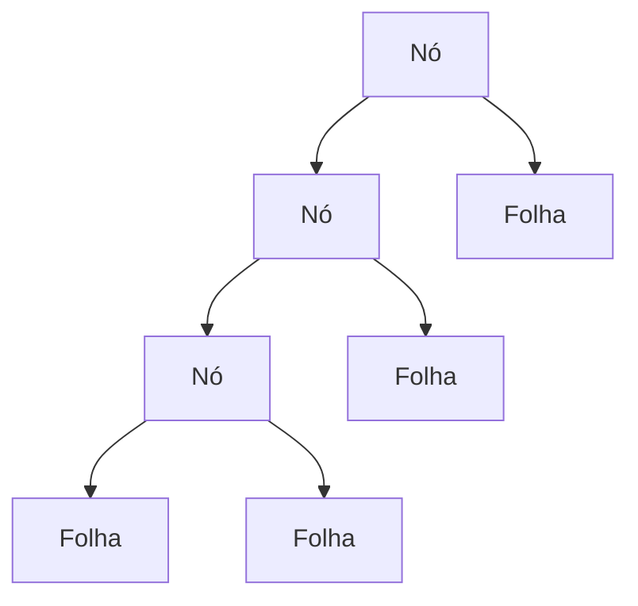
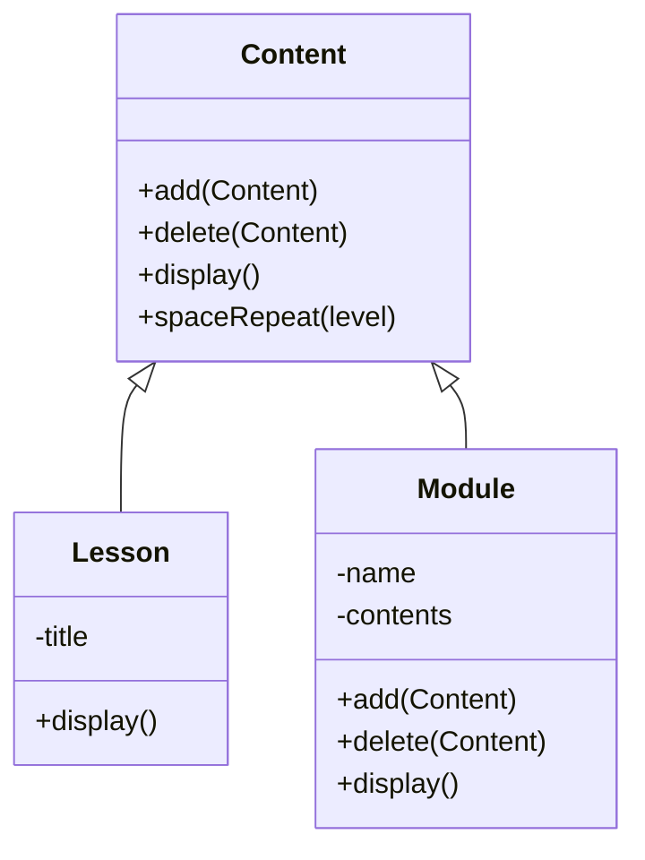

# Composite Pattern
O padrão Composite é um padrão estrutural que permite compor objetos em estruturas de árvore para representar hierarquias parte-todo, ou seja, objetos individuais e grupos de objetos são tratados da mesma maneira dentro  de um sistema.

> 📚 Os padrões de projeto estruturais se concentram em como as classes e objetos são compostos para formar estruturas maiores. Leia mais em [refactoring.guru](https://refactoring.guru/design-patterns/composite).

## Estrutura de árvore
De forma simplificada, a estrutura de árvore é composta por dois tipos de objetos: os nós e as folhas. Os nós são os objetos que contém outros objetos, enquanto as folhas são os objetos que não contém outros objetos.

## Exemplo
Para exemplicar, a presente implementação contém três classes principais: _Content_, _Lesson_ e _Module_. A classe _Content_ é a **classe abstrata** que representa o nó, enquanto as classes _Lesson_ e _Module_ são as classes que representam as folhas, conforme explicado anteriormente.

#### Observações

- O uso da classe abstrata para representar _Content_ é necessário para que as classes _Lesson_ e _Module_ possam ser tratadas da mesma forma, ou seja, tanto _Lesson_ quanto _Module_ são _Content_. Além disso, é possível definir implementações padrões que lançam exceções para métodos que não fazem sentido para todos os tipos de conteúdo. Por exemplo, o método `add(Content)` não faz sentido para a classe _Lesson_, pois uma _Lesson_ não pode conter outros conteúdos.
- O método `spaceRepeat(int level)` é um auxiliar para imprimir o resultado de forma hierárquica no console, constribuindo  para uma melhor visualização da composição final dos objetos.

## Sua vez
Implemente mais um tipo de conteúdo, por exemplo, _Exercise_, e adicione-o ao _Module 01: Primeiros passos com Java_.

# Referências
- [refactoring.guru](https://refactoring.guru/design-patterns/composite)
- [wikipedia.org](https://en.wikipedia.org/wiki/Composite_pattern)
- [OtavioMiranda - Youtube](https://www.youtube.com/watch?v=I0RqHDFQjVY)